# **Catacombs**

Catacombs es un videojuego 2D de mazmorras que simula un Top-Down RPG al estilo Zelda o Dragon Quest. 

## **Cómo jugar**

El juego está implementado con la intención de ser ampliable en un futuro, por lo que los objetivos alcanzados para la entrega de la práctica son fácilmente extensibles. Hasta la fecha, se dispone de 5 escenas de juego que incluyen:

>**1. Menu principal**: Con sus debidas transiciones, el menú principal no muestra el logo, los títulos y los elementos que conforman la escena de forma animada. Se dispone de botón para empezar una nueva partida o para cerrar la aplicación. 

>**2. Nivel 1**: Dispone de varias habitaciones por las que nos podemos mover. Los límites de la cámara están establecidos para cada habitación y se salta de una a otra mediante trigger. En las diferentes salas podemos encontrar varios tipos de enemigos y cofres del tesoro. Podemos atacar pulsando la barra espaciadora o interactuar con objetos pulsando la tecla Q.

>**3. Sala del tesoro**: Tras llegar al final del nivel, se puede acceder mediante unas escaleras a una sala separada que contiene un cofre con una llave. Esta llave nos permitirá abrir la puerta que nos lleva al jefe final.

>**4. Jefe final**: Tras llegar a esta sala debemos enfrentarnos al jefe para superar el juego y ganar la partida. Con unas mecánicas muy distintas al resto de enemigos, se dificulta un poco más la victoria al jugador. Tras vencer, se desbloquean las puertas de la sala y llegamos a la pantalla de fin de partida.

>**5. Fin de partida**: Se muestra el título "Game Over", los créditos y los botones para empezar una nueva partida o cerrar la aplicación de forma animada. 

Estas escenas son las que ha dado tiempo a implementar. Aún así, como ya se ha comentado, el juego es facilmente ampliable si se dispone de los recursos adecuados. Tan sólo sería necesario disponer de nuevos *sprites* (o los mismos utilizados) para generar un nuevo nivel y crear nuevos enemigos, así como más jefes finales. Incluso podría profundizarse más en la narrativa incluyendo más señales como la que encontramos al principio del nivel o añadiendo cutscenes que profundicen un poco más en el mundo ficcional. 

## **Estructura del juego**

En vez de explicar uno por uno los scripts, al ser un proyecto mucho más complejo en comparación a las otras prácticas realizadas, vamos a explicar por apartados las cuestiones más importantes de la gestión de recursos y el funcionamiento. En un futuro, si se retoma el proyecto, sería conveniente refactorizar un poco todos los scripts para que cumplan con su estricta funcionalidad y no mezclar objetivos. Es decir, si un script debe gestionar el movimiento, evitar en la medida de lo posible que actúe sobre otros aspectos del juego y permita una mayor modularidad y reaprovechamiento de las clases.

### **Jugador**

Al tratarse de un videojuego Top-Down, las físicas del juego son ligeramente diferente a las otras prácticas. Para empezar, el Rigidbody de cualquiera de los objetos de la escena debe tener gravedad 0 para que puedan moverse libremente por el mapa. Además, son necesarios sprites que dispongan de animaciones como mínimo en 4 direcciones distintas. Esto permitirá discernir en el Animator el sprite a utilizar según la dirección en la que miramos y, mediante el uso de *Blend Trees*, cambiar de uno a otro.

El script de movimiento de nuestro personaje recibe input por parte del usuario para moverse con las flechas del teclado y atacar con la barra espaciadora. Además, hay creados tres pequeños métodos que cumplen funcionalidades ligeramente distintas:

>**- Raise Item**: Función utilizada para mostrar la animación de que se ha recibido un objeto. Accede al inventario para mostrar el sprite del objeto obtenido.

>**- Update Anim And Move**: Actualiza la dirección en la que estamos mirando para cambiar el valor de los parámetros MoveX y MoveY del Animator. Estos dos parámetros son los encargados de gestionar el *Blend Tree* de movimiento y cambiar las animaciones. 

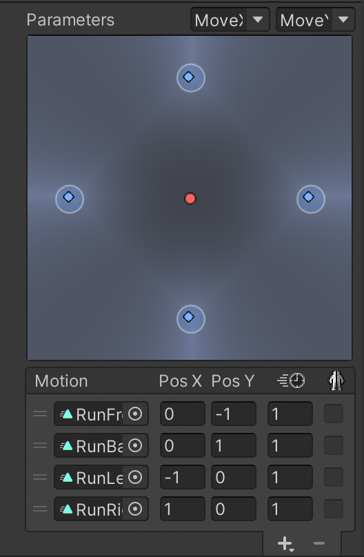

>**- Knockback**: Llamada desde el script Knockback tanto para el jugador como para los enemigos. Aplica una fuerza en sentido contrario al golpe recibido durante un tiempo específico. 

El sistema de salud del jugador parte de un script genérico llamado ***Generic Health***. Dicho script contiene funciones virtuales que pueden ser sobreescritas cada vez que creamos un script de salud para un nuevo objeto en el juego. En este caso, ***Player Health*** sobrescribe el método *Damage* para recibir daño y restar el daño al valor de la vida en tiempo de ejecución. Por último, revisa si las vidas han llegado a 0 y, en caso de cumplirse la condición, ejecuta la corutina que lanza las acciones correspondientes y nos lleva a la pantalla *Game Over* tras unos segundos. Este script va adjunto a un hijo del jugador que contiene un *Box Collider 2D* a modo de trigger para saber cuándo restar vida.

Para mostrar por pantalla la vida del personaje se ha utilizado un Canvas que contiene contenedores de vida en forma de corazón. Dichos contenedores se actualizan mediante la clase ***Heart Manager***, que revisa constantemente la salud del jugador para actualizar la UI en tiempo de ejecución. 

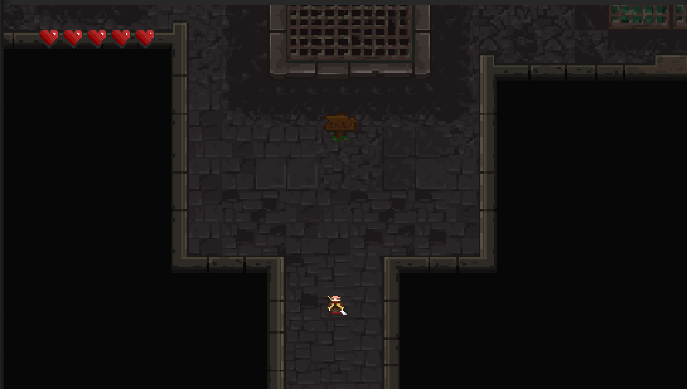

Por último, la gestión del daño se hace para todos igual. Mediante el script ***Generic Damage***. Se han creado objetos, hijos de los personajes, que contienen el script en cuestión y disponen de un *Polygon Collider* que actúa como trigger. Estos objetos están desactivados por defecto y, en cuanto se lanza la animación de atacar se activan para detectar la colisión y realizar el daño. 

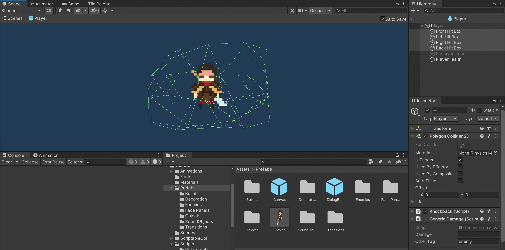

Tal y como se observa en la imagen, hay un objeto por cada dirección en la que podemos atacar y se activa consecuentemente a la dirección en la que estamos mirando.

### **Enemigos**

Básicamente hay dos tipos de enemigos implementados que se podría ampliar a más en un futuro. Entre ellos están los *Skeleton* y los *Patrol Skeleton*. 

>**- Skeleton**: Hereda de ***Basic Enemy*** la función *Knockback*. Su función principal es mantenerse estático en una posición y perseguir al jugador si este se encuentra dentro de cierto rango. El script ***Skeleton*** se encarga de llamar en cada frame a *Check Distance* para comprobar a qué distancia se encuentra del jugador. Si nos encontramos dentro de *chase radius* nos perseguirá, pero si salimos de este rango volverá a su posición inicial. Por último, si está en el rango de persecución y además se encuentra lo suficientemente cerca del jugador, atacará cada cierto tiempo mediante la llamada a la corutina *Attack*.

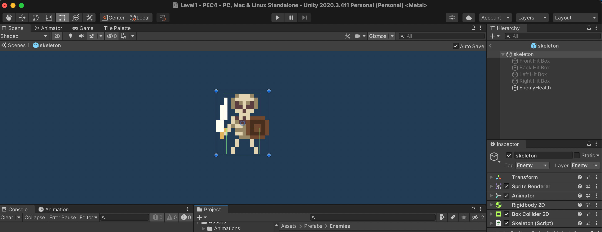

>De la misma forma que el jugador, dispone de las *hit boxes* para realizar daño cuando golpean y de *Enemy Health* para llevar la cuenta de la salud actual. 

>**- Patrol Skeleton**: Hereda de ***Skeleton***. La única diferencia entre ambos scripts es la posición del enemigo cuando el jugador está fuera de su radio de alcance. En este caso, se ha creado una serie de puntos en el espacio con sus determinadas coordenadas para que el esqueleto siga una ruta en concreto. 

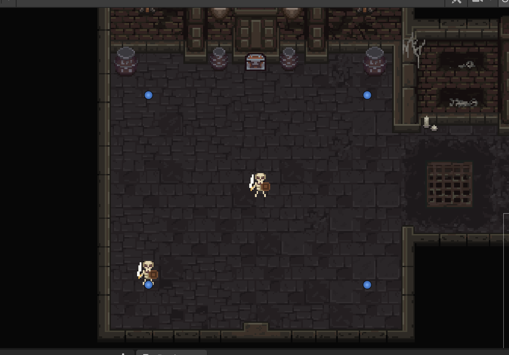

La gestión de la salud de los enemigos se realiza también con un script que hereda de ***Generic Health***; en este caso ***Enemy Health***. La funcionalidad del script es exactamente la misma con la ligera diferencia de la exitencia del metodo *Drop*. Este método se encarga de soltar un objeto contenido en un array de la clase ***Loot Table*** con un índice de probabilidad determinado (en nuestro caso sólo son pociones de vida, pero puede ser ampliable a otro tipo de objetos). 

### **Boss**

Se incluye en otro apartado debido a la complejidad del script con respecto a los otros. Para el comportamiento del boss se ha generado una máquina de estados que actualiza las acciones a realizar en cada momento. Los estados en los que puede estar el enemigo son: home, disappear, appear, attack, shoot y died. Este es su funcionamiento:

>**- Home**: Inicia un temporizador que hace al boss entrar en el estado *Disappear* al cabo de cierto tiempo.

>**- Disappear**: Lanza la animación de desaparecer y cuando esta termina aparece en otra posición. Dicha posición viene determinada por estado en el que hemos estado previamente. Si viene de atacar al jugador, aparece en home position. Si viene de estar en home position, aparece en una posición aleatoria dentro de un círculo unitario cerca del jugador. 

>**- Appear**: Lanza la animación de aparecer tras haber calculado la posición en la que debe hacerlo. Cuando termina la animación, si el turno corresponde a un ataque de tipo melee, pasará al estado Attack. Si el turno corresponde a un ataque de tipo disparo, pasa al estado Shoot. 

>**- Attack**: Tras aparecer en el círculo unitario cerca del jugador, lanza la animación de ataque. La gestión del ataque se hace de la misma forma que con el resto de personajes; se dispone de *hit boxes* con colliders que hacen de trigger para dañar al jugador.

>**- Shoot**: Aparece en home position e instancia una bala en dirección al jugador. 

El orden cronológico de la máquina de estados es el siguiente:

>1. Home
>2. Disappear
>3. Appear (al lado del jugador)
>4. Attack
>5. Disappear
>6. Appear (en home position)
>7. Shoot

Esta secuencia se repite hasta terminar el combate. 

### **Movimiento de cámara**

Como en otras prácticas, la cámara está implementada para seguir al jugador. De ello se encarga el script ***Camera System***. Dicho script lo primero que hace es mostrar por pantalla el nombre de la nueva escena a la que hemos entrado. Además, en cada cíclo actualiza su posición para seguir al jugador y mediante *Mathf.Clamp* y *Mathf.Lerp* hace que el seguimiento sea fluido y a una velocidad determinada, además de fijar los bordes de la habitación para que no podamos sobrepasarlos.

De forma añadida, la cámara tiene dos clases adicionales que se adjuntan a los prefabs *Room Transition* y *Scene Transition*. Dichos scripts son:

>**- Room Change**: Asigna el objeto de la cámara a la variable correspondiente y resetea los valores de los bordes a los de la nueva sala. Para ello se utilizan objetos vacios que contienen el script y que disponen de un *Box Collider 2D* como trigger para detectar cuándo se cambia de sala.

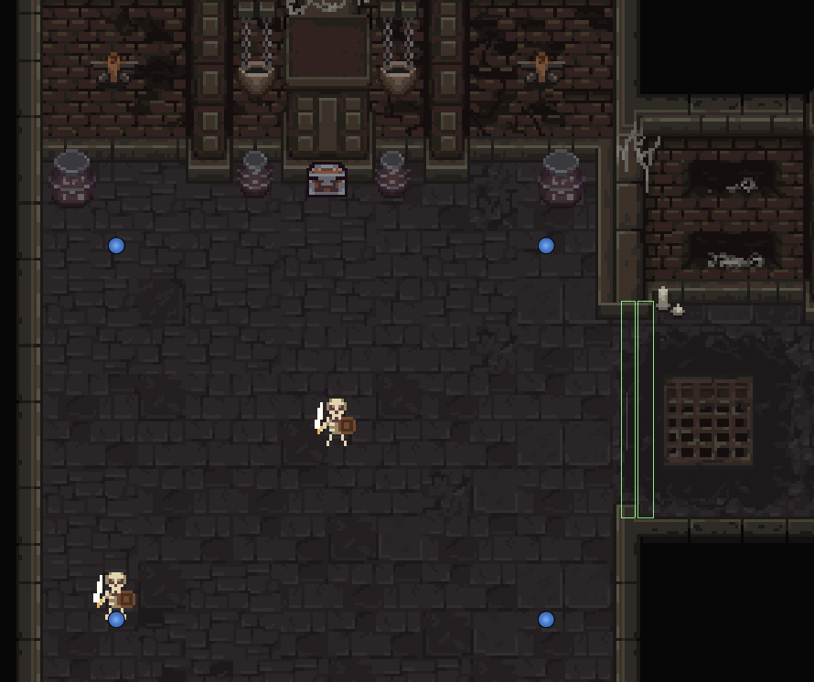

>Como se observa en la imagen, tenemos collider de entrada y de salida. Para evitar conflicto entre triggers, cada vez que entramos a una nueva sala movemos la posición del jugador en 1 unidad en la dirección correspondiente para que se sale el trigger de salida. 

>**- Scene Transition**: Funciona de la misma manera que ***Room Change*** pero en vez de cambiar de sala, cambia de escena. Para conservar los valores de la posición del jugador y la cámara en la escena anterior, se usan *Scriptable Objects* (explicados más adelante) que contienen los vectores con las posiciones y los bordes correspondientes. Además, genera un pantallazo blanco a modo de transición al entrar en la nueva escena. 

### **Objetos**

#### **Door y Boss Door**

A lo largo del juego hay puertas que sólo se abren si se cumplen ciertas condiciones. Básicamente tenemos dos tipos de puerta: las que necesitan llave y las que requieren derrotar al enemigo.

> - Puertas con llave: Si intentamos abrirla sin disponer de la llave nos salta un mensaje para avisarnos de que hay que conseguirla primero. Una vez dispongamos de la llave, esta se abrira sin problema. Esto se gestiona mediante el script ***Door*** que, si estamos dentro de cierto rango de accion y tenemos la llave, llamará a la función *Open* y restará una llave de nuestro inventario. De lo contrario, activará un cuadro de texto con el mensaje mencionado anteriormente. 

> - Puerta del boss: Hereda de ***Door***. Lleva un registro del boss y revisa si ha sido derrotado. En cuanto esta condición se cumple, se llama a la función *Open* de la clase principal y se desactiva el bloquer que nos impide volver a la sala anterior. 

#### **Chest**

El objeto del cofre tiene un script propio que gestiona los diferentes prefabs en función de su contenido. Al interactuar con el cofre se lanza la animación de abrir y se muestra el contenido que hay dentro. Puede ser una llave, un contenedor de vida o estar vacío (esto es ampliable en un futuro). El contenido del cofre vendrá determinado por nuestro *Scriptable Object* de tipo Item; en este caso cualquiera de las tres opciones anteriores. En el caso de que sea un contenedor de vida, se llama al método *AddExtraLife*, que actualiza la UI añadiendo un corazón extra y recupera nuestra salud al máximo. 

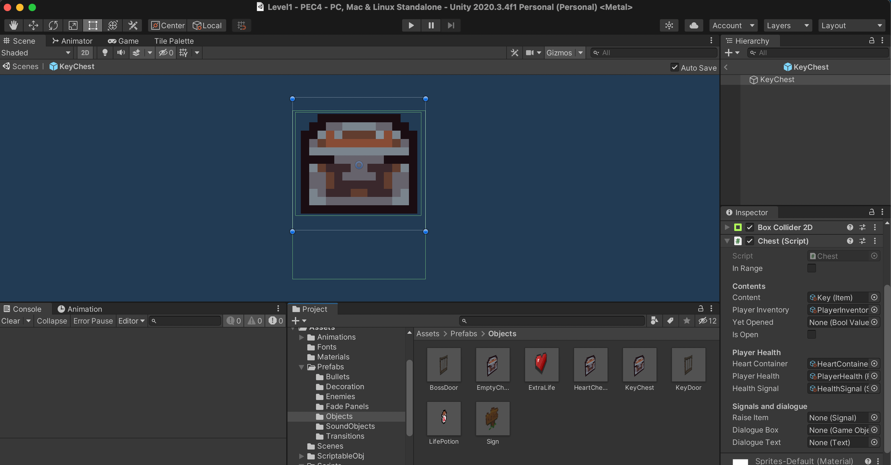

#### **Life Potion**

Hereda de ***Power Up***. La implementación de la clase principal es sencilla para poder crear más de un power up si queremos en un futuro. Tan sólo contiene un *Scriptable Object* de tipo *Signal* que suscribe a una lista de listeners. A dicha lista podemos añadir o quitar objetos según los utilicemos. Esto es muy útil a la hora de crear un posible inventario. 

La poción de vida la sueltan los enemigos al morir con una probabilidad del 25%. Contiene el script ***Life Potion*** que suma un porcentaje determinado de vida al jugador y se destruye cuando lo recogemos. Para ello usa un *Box Collider 2D* a modo de trigger. 

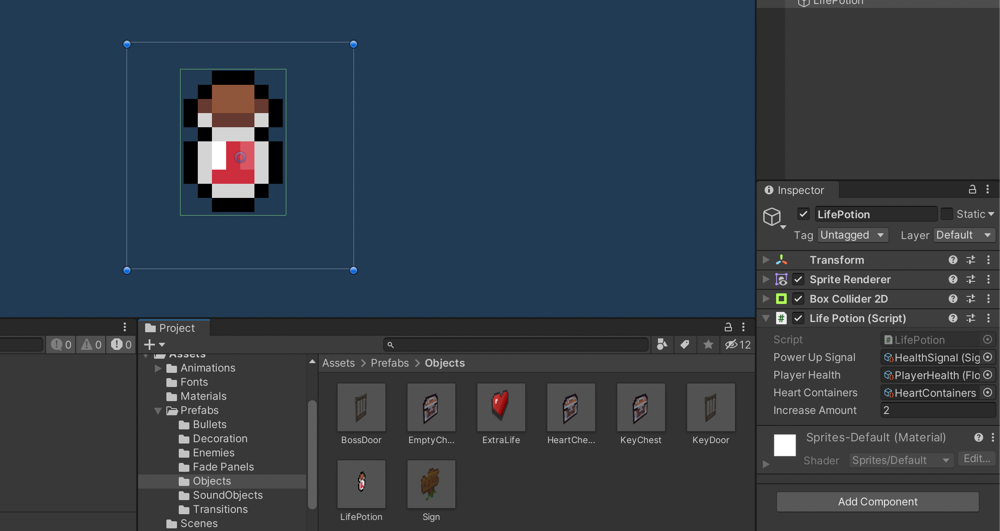

#### **Bullet**

Gestiona el comportamiento de las balas instanciadas por el boss. Este script es reutilizable para cualquier enemigo que dispare al jugador. Lleva un registro de la última posición en la que se encontraba el jugador en el momento de instanciar la bala y se mueve hacia ese punto. Una vez llega se destruye. 

### **Gestión de sonidos**

Los sonidos del juego se gestionan mediante ***Sound Manager***. Dispone de un switch case para cada uno de los sonidos disponibles en el juego y llama a la función *SoundObjectCreation* para los fx y a *MusicObjectCreation* para la banda sonora. Estas funciones instancian un prefab generado que contiene un *Audio Source* y el script *Kill Sound*. 

*Kill Sound* detecta cuándo se termina el clip de audio y destruye el objeto justo en ese momento.

Para acceder a las funciones correspondientes en los momentos en que se ejecutan las acciones tan sólo hay que escribir la siguiente línea de código: `SoundManager.soundManager.PlaySfx("string");` o `SoundManager.soundManager.PlayMusic("string");`.

### **Gestión de memoria**

A lo largo del Readme se ha incorporado el concepto de los *Scriptable Objects*. El uso de este elemento se ha incorporado de forma nueva en esta práctica y básicamente permiten generar archivos del tipo deseado en el editor de Unity. Es decir, creamos un script que herede de *Scriptable Objects* en vez de *Mono Behaviour* de la siguiente manera:

>`[CreateAssetMenu]`
>`[System.Serializable]`
>`public class BoolValue : ScriptableObject`
>`{`
>  `  public bool initValue;`
> `   public bool runtimeValue; `
>`}`

Con Create Asset Menu podemos crear nuevos assets en Unity de tipo Bool Value que permitirá guardar un valor initValue inicial y un valor runtimeValue que servirá en tiempo de ejecución. 

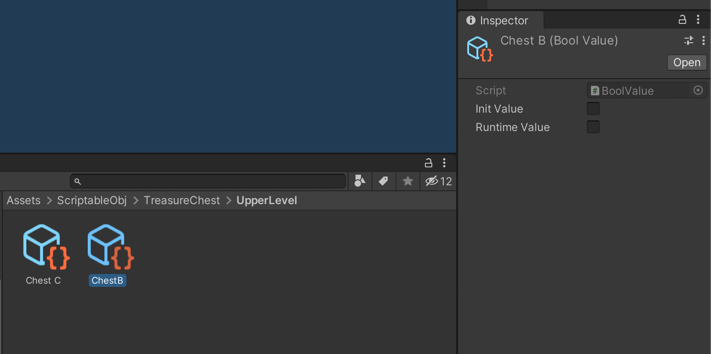

Esto se puede realizar con valores de tipo *float*, de tipo *int*, de tipo *string*, etc. Son muy útiles si queremos generar assets que guarden valores añadibles a distintos objetos y que cumplan una misma funcionalidad. Un claro ejemplo de esto son los puntos de vida de nuestros enemigos: 

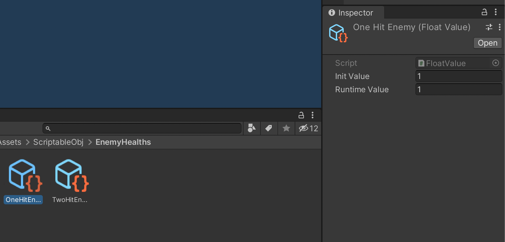

En este caso disponemos de un *float value* que asignamos a todos los enemigos que tengan un sólo punto de vida. Si queremos que un enemigo en cuestión tenga 5 puntos de vida, tan sólo tenemos que crear otro *float value* cuyo valor inicial sea 5. 

A la hora de guardar datos en memoria, se ha creado el script ***Data Manager***. Este script genera un fichero que guarda la información de nuestros *Scriptable Objects*. De esta forma, si hemos abierto un cofre en la escena anterior y volvemos, estos se mantendrán abiertos. 

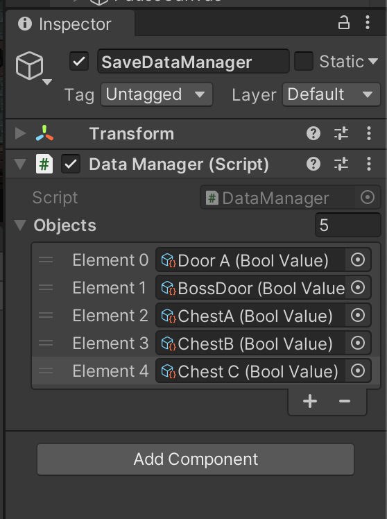

Si quisieramos que los enemigos no reaparezcan, podemos crear un *bool value* que guarde en memoria estos parámetros y al cargar la escena, todos aquellos ya eliminados no aparecerían de nuevo. 

### **Menu de pausa**

Por último, se ha creado un menú de pausa con varios botones que permiten continuar con la partida, guardar los datos o quitar el juego. En este menú se ha incorporado un botón de debugging que debe estar inactivo a la hora de hacer un build. Este botón permite eliminar los valores guardados en nuestro data manager para después guardar. De esta forma, evitamos tener que cambiar uno a uno todos los valores de los *scriptable objects* a mano cada vez que probamos alguna funcionalidad del juego. 

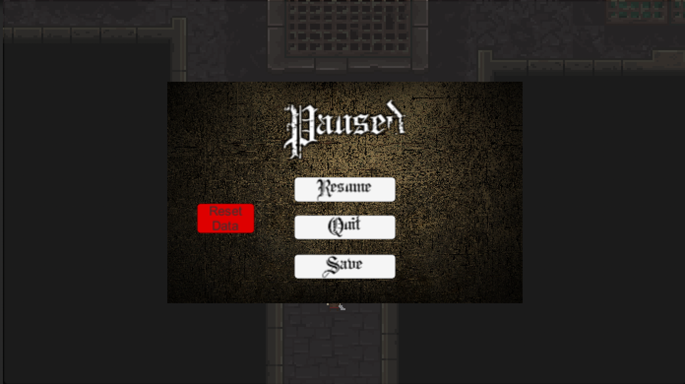

